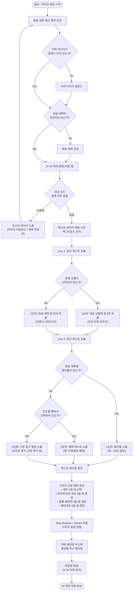
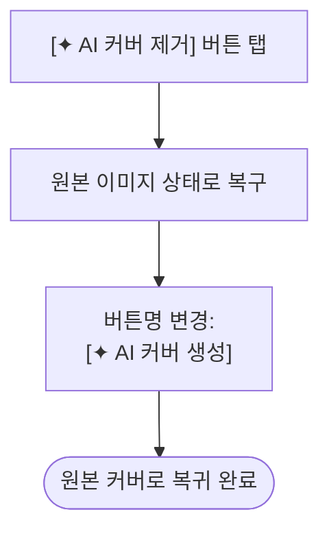
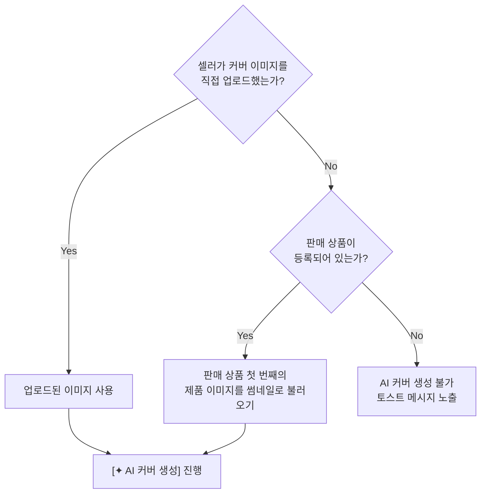
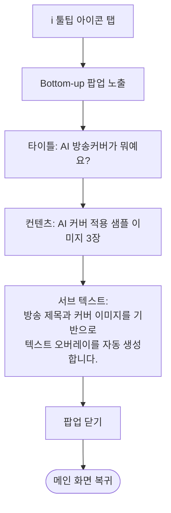
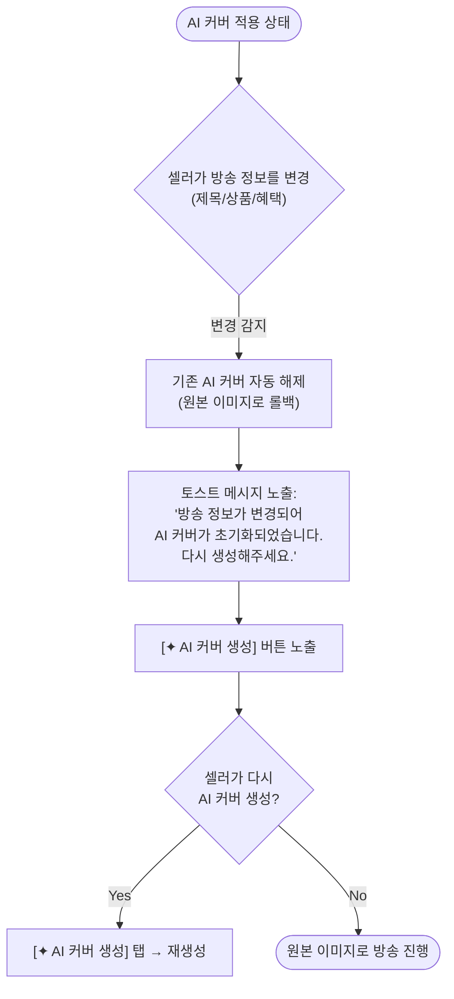

# 유저 플로우 - AI 방송 썸네일 텍스트 자동 생성

## 메인 유저 플로우 (AI 커버 생성)



---

## AI 커버 제거 플로우



---

## 이미지 미업로드 시 대체 플로우



---

## 툴팁 정보 플로우



---

## Phase 2: 데이터 변경 시 동기화 플로우 (권장안 - B안)



---

## 전체 통합 플로우 요약

```
[셀러 앱 진입]
      │
      ▼
[라이브 방송 시작]
      │
      ▼
[방송 설정 메인 화면]
      │
      ├──→ 방송 제목 입력 ──────────────────┐
      ├──→ 커버 이미지 업로드 ────────────────┤
      ├──→ 판매 상품 선택 (옵션) ─────────────┤
      ├──→ 강조 혜택 입력 (옵션) ─────────────┤
      │                                      │
      │    ┌───────────────────────────────────┘
      │    ▼
      ├──→ [✦ AI 커버 생성] 버튼 탭
      │         │
      │         ├── 조건 미충족 → 토스트 알림
      │         │
      │         └── 조건 충족
      │              │
      │              ▼
      │         [텍스트 추출 + 렌더링]
      │              │
      │              ▼
      │         [커버에 즉시 반영]
      │              │
      │              ▼
      │         [✦ AI 커버 제거] 버튼으로 전환
      │              │
      │              ├── 제거 탭 → 원본 복구
      │              └── 유지 → 방송 시작
      │
      └──→ [ℹ️ 툴팁] → AI 방송커버 설명 팝업
```
